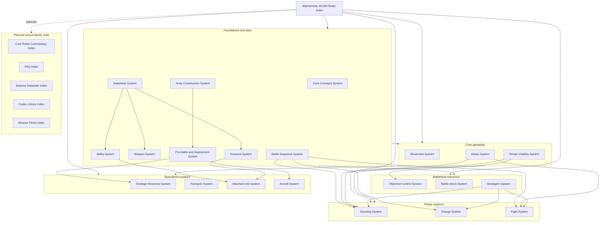

# Warhammer 40,000 Rules Index

## Overview

Warhammer 40,000 Rules Index is the authoritative System Article for the top-level navigation of the Warhammer 40,000 Core Rules knowledge base. It routes readers to the correct published domain, shows how the major systems fit together, and provides a stable root surface that can expand later to commentary, FAQ, dataslate, codex, and mission-pack navigation without duplicating child rule meaning.

## Language Navigation

- English article index: [[Warhammer 40k Rules/en/English Index|English Index]]
- Spanish article index: [[Warhammer 40k Rules/es/Índice|Índice]]
- Bilingual domain map: [[Warhammer 40k Rules/Índice bilingüe|Índice bilingüe]]

## Scope

This page covers the published core-rules navigation surface as a whole. It helps answer where to start, which domain owns a question, and which neighbouring system to read next when a lookup crosses from foundational concepts into timing, data modelling, movement, combat, battlefield state, or specialized force-structure rules.

The top-level navigation hierarchy is organized as follows:

- Foundations and data: [[Core Concepts System]], [[Battle Sequence System]], [[Datasheet System]], [[Weapon System]], [[Ability System]], [[Keyword System]], and [[Army Construction System]], [[Pre-battle and Deployment System]].
- Core gameplay: [[Movement System]], [[Attack System]], and [[Terrain Visibility System]].
- Phase systems: [[Shooting System]], [[Charge System]], and [[Fight System]].
- Battlefield interaction: [[Objective Control System]], [[Battle-shock System]], and [[Stratagem System]].
- Specialized systems: [[Strategic Reserves System]], [[Transport System]], [[Attached Unit System]], and [[Aircraft System]].

### Navigation Architecture

## Domain Ownership

- Owner domain: Core Rules.
- Publication role: maintain the root navigation surface for the published core-rules domains and the planned top-level hubs that will extend the knowledge base beyond the core rules.
- Domain system role: provide the authoritative entry point and navigation surface for cross-domain browsing, first-hop routing, and future top-level expansion without taking ownership of child rule meaning.

## Domain Boundaries

Warhammer 40,000 Rules Index owns:

- the root MOC for the published core-rules knowledge base;
- the reader-facing grouping of domains into foundations, gameplay, phases, battlefield interaction, and specialized systems;
- the top-level distinction between published domain hubs and planned future source-family hubs.

Warhammer 40,000 Rules Index does not own:

- the canonical rule meaning already owned by child systems such as [[Core Concepts System]], [[Movement System]], [[Attack System]], [[Terrain Visibility System]], and [[Objective Control System]];
- domain-specific concept, procedure, glossary, or alias surfaces already governed inside their own domains;
- future commentary, FAQ, dataslate, codex, or mission-pack content until those source families have their own published hubs.

## Published Articles

### Foundations And Data

- [[Core Concepts System]]
- [[Battle Sequence System]]
- [[Datasheet System]]
- [[Weapon System]]
- [[Ability System]]
- [[Keyword System]]
- [[Army Construction System]]
- [[Pre-battle and Deployment System]]

### Core Gameplay

- [[Movement System]]
- [[Attack System]]
- [[Terrain Visibility System]]

### Phase Systems

- [[Shooting System]]
- [[Charge System]]
- [[Fight System]]

### Battlefield Interaction

- [[Objective Control System]]
- [[Battle-shock System]]
- [[Stratagem System]]

### Specialized Systems

- [[Strategic Reserves System]]
- [[Transport System]]
- [[Attached Unit System]]
- [[Aircraft System]]

## Planned Articles

### Planned Source-family Hubs

- Core Rules Commentary Index
- FAQ Index
- Balance Dataslate Index
- Codex Library Index
- Mission Packs Index
- Appendix and Reference Index

### Scaling Strategy

- Keep Core Rules as the baseline rules layer that generic mechanics link back to.
- Publish one root hub per source family before publishing large clusters of commentary, FAQ, dataslate, codex, or mission-pack pages.
- Keep later source-family hubs linked back to the relevant published core-rules systems instead of re-explaining shared mechanics.
- Treat commentary, FAQ, and dataslate material as override or clarification layers above the core-rules systems rather than as replacements for them.
- Treat codex and mission-pack hubs as parallel entry points that reuse the core-rules navigation spine wherever possible.

## Related Systems

- [[Core Concepts System]] provides the foundational vocabulary and battlefield state language consumed across the whole wiki.
- [[Battle Sequence System]] provides the timing spine that routes readers into phase and timing questions.
- [[Attack System]] provides the shared attack pipeline reused by both ranged and melee combat domains.
- [[Terrain Visibility System]] provides the battlefield-state layer consumed by movement, shooting, and objectives.
- [[Objective Control System]] provides the control, scoring, and action-state cluster that many downstream rules modify.
- [[Army Construction System]] provides the list-building layer before pre-battle setup.
- [[Pre-battle and Deployment System]] provides the setup-stage bridge into reserves, aircraft, and other before-the-battle decisions.

## Navigation

### Recommended Reading Paths

- New reader path: [[Core Concepts System]] -> [[Battle Sequence System]] -> [[Battle Round]] -> [[Turn Structure]] -> [[Movement Phase]] -> [[Movement System]] -> [[Shooting Phase]] -> [[Shooting System]] -> [[Charge Phase]] -> [[Charge System]] -> [[Fight Phase]] -> [[Fight System]] -> [[Command Phase]] -> [[Battle-shock System]].
- Battlefield control path: [[Terrain Visibility System]] -> [[Objective Control System]] -> [[Battle-shock System]] -> [[Stratagem System]].
- Army construction path: [[Army Construction System]] -> [[Pre-battle and Deployment System]].
- Force-structure path: [[Pre-battle and Deployment System]] -> [[Strategic Reserves System]] -> [[Transport System]] -> [[Aircraft System]] -> [[Attached Unit System]].

### Domain Entry-point Map

| Reader question | Start here | Common next hops |
| --- | --- | --- |
| What are the baseline unit, measurement, setup, and state concepts? | [[Core Concepts System]] | [[Battle Sequence System]], [[Datasheet System]], [[Movement System]] |
| When does something happen in the turn or battle loop? | [[Battle Sequence System]] | [[Battle Round]], [[Turn Structure]], [[Command Phase]], [[Movement Phase]], [[Shooting Phase]], [[Charge Phase]], [[Fight Phase]] |
| How is information printed on datasheets and weapons? | [[Datasheet System]] | [[Weapon System]], [[Ability System]], [[Keyword System]] |
| How do abilities and keywords shape rule behaviour? | [[Ability System]] | [[Keyword System]], [[Attached Unit System]], [[Attack System]] |
| How does movement, placement, or positioning work? | [[Movement System]] | [[Terrain Visibility System]], [[Charge System]], [[Transport System]], [[Strategic Reserves System]] |
| How are attacks declared, resolved, and converted into damage? | [[Attack System]] | [[Shooting System]], [[Fight System]], [[Ability System]] |
| How does ranged combat work? | [[Shooting System]] | [[Attack System]], [[Terrain Visibility System]], [[Stratagem System]] |
| How does a unit enter and resolve melee? | [[Charge System]] | [[Fight System]], [[Attack System]], [[Movement System]] |
| How do terrain, cover, visibility, and line-of-sight state work? | [[Terrain Visibility System]] | [[Movement System]], [[Shooting System]], [[Objective Control System]] |
| How do objectives, actions, and control state work? | [[Objective Control System]] | [[Battle-shock System]], [[Terrain Visibility System]], [[Movement System]] |
| How do I build an army list and choose detachments? | [[Army Construction System]] | [[Detachment Points]], [[Detachments]], [[Battle Size]], [[Pre-battle and Deployment System]] |
| How do reserves, transports, and aircraft enter play? | [[Pre-battle and Deployment System]] | [[Strategic Reserves System]], [[Transport System]], [[Aircraft System]] |
| How do leaders and bodyguards behave as combined units? | [[Attached Unit System]] | [[Keyword System]], [[Ability System]], [[Attack System]] |
| Which phase exceptions or command-point tools modify the flow? | [[Stratagem System]] | [[Battle-shock System]], [[Strategic Reserves System]], [[Shooting System]], [[Charge System]], [[Fight System]] |

## See Also

- [[Units and Models]]
- [[Measuring Distances]]
- [[Set Up]]
- [[Making Attacks]]
- [[Charge]]
- [[Fight]]
- [[Strategic Reserves]]
- [[Attached unit]]