# Sistema de carga

## Resumen

El sistema de carga reúne la secuencia completa para declarar y resolver cargas durante la [[Fase de carga]], desde la comprobación de aptitud hasta las consecuencias de completar un [[Movimiento de carga]].

## Definición

El jugador activo resuelve sus cargas de una en una. Cada carga distingue entre la aptitud para declararla, la distancia obtenida, la elección de [[Blanco de la carga|blancos de la carga]], la posibilidad de hacer un movimiento legal y la validación de la posición final.

## Reglas

### Inventario de decisiones

| ID | Decisión |
| --- | --- |
| `D1` | ¿El jugador activo quiere declarar otra carga? |
| `D2` | ¿La unidad está en el campo de batalla o tiene un permiso especial? |
| `D3` | ¿Hay al menos una unidad enemiga a 12" o menos? |
| `D4` | ¿La unidad está trabada sin permiso para cargar? |
| `D5` | ¿La unidad avanzó este turno sin permiso para cargar? |
| `D6` | ¿La unidad retrocedió este turno sin permiso para cargar? |
| `D7` | ¿Otra regla impide que declare una carga? |
| `D8` | ¿La unidad es `AIRCRAFT`? |
| `D9` | ¿Se usa una repetición o un modificador legal de la tirada? |
| `D10` | ¿Una unidad que puede volar alzará el vuelo? |
| `D11` | ¿Existe al menos un blanco dentro de 12" y de la distancia máxima? |
| `D12` | ¿Se ha elegido alguna unidad `AIRCRAFT` como blanco? |
| `D13` | ¿La unidad que carga puede volar? |
| `D14` | ¿Queda al menos un blanco legal? |
| `D15` | ¿La unidad puede acabar trabada con todos los blancos elegidos? |
| `D16` | ¿Puede evitar acabar trabada con unidades enemigas no elegidas? |
| `D17` | ¿Todas las miniaturas que se muevan pueden acabar más cerca de un blanco? |
| `D18` | ¿Las miniaturas que puedan acabar a 1" o menos de un blanco pueden hacerlo? |
| `D19` | ¿Las miniaturas que puedan acabar trabadas con un blanco pueden hacerlo? |
| `D20` | ¿La unidad puede acabar en coherencia y respetar las restricciones de movimiento? |
| `D21` | ¿El jugador todavía quiere hacer el movimiento de carga? |
| `D22` | ¿Puede y quiere usar [[Impacto aplastante]]? |
| `D23` | ¿El jugador oponente puede y quiere usar [[Intervención heroica]]? |
| `D24` | ¿Qué modo de Intervención heroica se usa? |

### Resultados terminales

| ID | Resultado |
| --- | --- |
| `T1` | La unidad no puede declarar una carga. |
| `T2` | No existe un movimiento de carga legal y la unidad no mueve. |
| `T3` | La carga se resuelve sin movimiento por decisión del jugador. |
| `T4` | El movimiento realizado no supera la validación; las miniaturas vuelven a sus posiciones iniciales y la unidad no mueve. |
| `T5` | El movimiento de carga se completa con éxito. |
| `T6` | No se declaran más cargas. |
| `T7` | Intervención heroica no se utiliza. |
| `T8` | Intervención heroica se resuelve aplicando el modo elegido. |
| `T9` | Comienza la fase de combate. |

### Diagrama de flujo

```mermaid
flowchart TD

  subgraph INICIO["Inicio de fase"]
    A1([Inicio de la fase de carga])
    A2[Resolver reglas de inicio de fase]
    D1{¿Declarar otra carga?}
    A1 --> A2 --> D1
  end

  subgraph DECLARAR["Declarar carga"]
    A3[Elegir una unidad amiga<br/>que aún no haya declarado carga]
    D2{¿Está en el campo de batalla<br/>o tiene permiso especial?}
    D3{¿Hay algún enemigo<br/>a 12 pulgadas o menos?}
    D4{¿Está trabada<br/>sin permiso para cargar?}
    D5{¿Avanzó<br/>sin permiso para cargar?}
    D6{¿Retrocedió<br/>sin permiso para cargar?}
    D7{¿Otra regla impide<br/>declarar la carga?}
    D8{¿Es AIRCRAFT?}
    A4[Declarar la carga]
    T1([No puede declarar carga])

    A3 --> D2
    D2 -- Sí --> D3
    D2 -- No --> T1
    D3 -- Sí --> D4
    D3 -- No --> T1
    D4 -- Sí --> T1
    D4 -- No --> D5
    D5 -- Sí --> T1
    D5 -- No --> D6
    D6 -- Sí --> T1
    D6 -- No --> D7
    D7 -- Sí --> T1
    D7 -- No --> D8
    D8 -- Sí --> T1
    D8 -- No --> A4
  end

  subgraph TIRADA["Tirada de carga"]
    R1[Tirar 2D6]
    D9{¿Usar Repetición de mando<br/>u otra repetición legal?}
    R2[Repetir los 2D6 completos]
    R3[Aplicar modificadores legales]
    R4[Obtener el resultado final]
    R5[Determinar la distancia máxima]

    R1 --> D9
    D9 -- Sí --> R2 --> R3
    D9 -- No --> R3
    R3 --> R4 --> R5
  end

  subgraph OBJETIVOS["Elegir objetivos"]
    D10{¿Puede volar y<br/>alzará el vuelo?}
    O1[Reducir la distancia máxima<br/>en 2 pulgadas]
    D11{¿Existe un enemigo a 12 pulgadas<br/>y dentro de la distancia máxima?}
    O2[Elegir uno o más<br/>blancos de la carga]
    D12{¿Algún blanco<br/>es AIRCRAFT?}
    D13{¿La unidad que carga<br/>puede volar?}
    O3[Retirar blancos AIRCRAFT ilegales]
    D14{¿Queda algún<br/>blanco legal?}

    D10 -- Sí --> O1 --> D11
    D10 -- No --> D11
    D11 -- Sí --> O2 --> D12
    D11 -- No --> T2
    D12 -- No --> D15
    D12 -- Sí --> D13
    D13 -- Sí --> D15
    D13 -- No --> O3 --> D14
    D14 -- Sí --> D15
    D14 -- No --> T2
  end

  subgraph MOVIMIENTO["Movimiento de carga"]
    D15{¿Puede acabar trabada<br/>con todos los blancos?}
    D16{¿Puede evitar unidades<br/>que no sean blancos?}
    D17{¿Cada miniatura movida<br/>puede acabar más cerca?}
    D18{¿Puede cumplir la obligación<br/>de acabar a 1 pulgada?}
    D19{¿Puede cumplir la obligación<br/>de acabar trabada?}
    D20{¿Puede acabar en coherencia<br/>y respetar el movimiento normal?}
    D21{¿Todavía quiere<br/>hacer el movimiento?}
    M1[Mover miniaturas una a una<br/>hasta la distancia máxima]
    M2[Aplicar rutas, terreno<br/>y restricciones normales]
    T2([No hay movimiento legal:<br/>la unidad no mueve])
    T3([Carga resuelta:<br/>el jugador decide no mover])

    D15 -- Sí --> D16
    D15 -- No --> T2
    D16 -- Sí --> D17
    D16 -- No --> T2
    D17 -- Sí --> D18
    D17 -- No --> T2
    D18 -- Sí --> D19
    D18 -- No --> T2
    D19 -- Sí --> D20
    D19 -- No --> T2
    D20 -- Sí --> D21
    D20 -- No --> T2
    D21 -- Sí --> M1 --> M2
    D21 -- No --> T3
  end

  subgraph VALIDACION["Validación final"]
    V1{¿Trabada con<br/>todos los blancos?}
    V2{¿Sin trabarse con<br/>enemigos no elegidos?}
    V3{¿Unidad en coherencia?}
    V4{¿Ruta, posición final y<br/>obligaciones cumplidas?}
    T4([Movimiento inválido:<br/>volver a posiciones iniciales])

    M2 --> V1
    V1 -- Sí --> V2
    V1 -- No --> T4
    V2 -- Sí --> V3
    V2 -- No --> T4
    V3 -- Sí --> V4
    V3 -- No --> T4
    V4 -- No --> T4
  end

  subgraph CONSECUENCIAS["Consecuencias"]
    T5([Movimiento de carga completado])
    C1[La unidad ha hecho<br/>un movimiento de carga]
    C2[Cada miniatura obtiene<br/>Combatir primero hasta final del turno]
    D22{¿MONSTER o VEHICLE<br/>y puede usar Impacto aplastante?}
    C3[Resolver Impacto aplastante]

    V4 -- Sí --> T5 --> C1 --> C2
    C2 -. opcional .-> D22
    D22 -- Sí --> C3
  end

  subgraph HEROICA["Intervención heroica"]
    D23{¿El jugador oponente puede y quiere<br/>usar Intervención heroica?}
    D24{¿Usar Hacia el conflicto?}
    H1[A defender:<br/>solo enemigos que cargaron]
    H2[Hacia el conflicto:<br/>+1 PM y resultado máximo 6]
    H3[Resolver la carga especial<br/>aplicando el modo elegido]
    T7([Intervención no utilizada])
    T8([Intervención resuelta])

    D23 -- No --> T7
    D23 -- Sí --> D24
    D24 -- No --> H1 --> H3
    D24 -- Sí --> H2 --> H3
    H3 --> T8
  end

  N1[Una regla externa puede modificar<br/>permisos, tiradas, distancia o movimiento]
  N2[Medir desde los puntos más cercanos<br/>aplicables de las miniaturas]
  T6([No se declaran más cargas])
  A5[Final de la fase de carga]
  A6[Resolver reglas de final de fase]
  T9([Comenzar la fase de combate])

  D1 -- Sí --> A3
  D1 -- No --> T6
  A4 --> R1
  R5 --> D10

  N1 -. modificador externo .-> D7
  N1 -. modificador externo .-> R3
  N1 -. modificador externo .-> D20
  N2 -. medición .-> D3
  N2 -. medición .-> D11

  T1 --> D1
  T2 --> D1
  T3 --> D1
  T4 --> D1
  D22 -- No --> D1
  C3 --> D1

  T6 --> A5
  A5 --> A6
  A6 --> D23
  T7 --> T9
  T8 --> T9
```

### Notas editoriales

- La aptitud para declarar una carga se comprueba antes de tirar los dados. Tener una unidad enemiga a 12" o menos no garantiza que después exista un blanco legal o un movimiento posible.
- La tirada de carga fija la distancia máxima. Una [[Repetición de mando]] repite los dos dados completos.
- Alzar el vuelo se representa antes de elegir los blancos porque modifica la distancia máxima disponible para el movimiento de carga.
- Los blancos deben estar a 12" o menos y dentro de la distancia máxima. Elegir varios blancos obliga a terminar trabada con todos ellos.
- Las comprobaciones previas determinan si existe algún movimiento legal. La validación final comprueba que el movimiento realizado cumple realmente todas las condiciones.
- Las obligaciones de acabar más cerca, a 1" o menos o trabada se aplican a las miniaturas que se muevan y puedan cumplir la condición correspondiente.
- Una unidad puede declarar y resolver una carga sin llegar a hacer un movimiento: porque no exista un movimiento legal, porque el jugador decida no hacerlo o porque la posición final resulte inválida.
- [[Intervención heroica]] usa el procedimiento de carga, pero añade sus propias restricciones de selección y de blancos.
- Los modificadores externos representan únicamente reglas que alteren expresamente el procedimiento. No presuponen ninguna regla de facción, hoja de datos, destacamento o misión.

## Interacciones

- [[Fase de carga]] contiene la ventana temporal del sistema.
- [[Cargar]] gobierna la aptitud, la declaración, la tirada y el resultado sin movimiento.
- [[Movimiento de carga]] gobierna la elección de blancos, el desplazamiento y sus condiciones finales.
- [[Mover unidades]] y [[Medir distancias]] aportan las restricciones generales que siguen aplicándose.
- [[Miniaturas que vuelan]] puede modificar la distancia y la ruta del movimiento.
- [[Carga y combate de aeronaves]] impide que una unidad `AIRCRAFT` declare cargas y limita qué unidades pueden elegirla como blanco.
- [[Combatir primero]] es la consecuencia de combate obtenida por cada miniatura que completa el movimiento con su unidad.

## Restricciones

- El diagrama no concede permisos para cargar, repetir tiradas, ignorar terreno o usar estratagemas.
- Las reglas específicas solo modifican los nodos que alteren expresamente.
- El diagrama no sustituye las condiciones completas de las reglas canónicas enlazadas.
- Las reglas de facción, hoja de datos, destacamento y misión quedan fuera de este sistema salvo como modificadores externos genéricos.

## Conceptos relacionados

- [[Fase de carga]]
- [[Cargar]]
- [[Movimiento de carga]]
- [[Blanco de la carga]]
- [[Miniaturas que vuelan]]
- [[Carga y combate de aeronaves]]
- [[Repetición de mando]]
- [[Impacto aplastante]]
- [[Intervención heroica]]
- [[Combatir primero]]

## Referencias

- Reglas básicas oficiales: Inicio de la fase de carga 11.01.
- Reglas básicas oficiales: Cargar 11.02.
- Reglas básicas oficiales: Final de la fase de carga 11.03.
- Reglas básicas oficiales: Movimiento de carga 11.04.
- Reglas básicas oficiales: Mover unidades 03.01.
- Reglas básicas oficiales: Medir distancias 01.04.
- Reglas básicas oficiales: Repetición de mando 15.02.
- Reglas básicas oficiales: Impacto aplastante 15.06.
- Reglas básicas oficiales: Intervención heroica 15.11.
- Reglas básicas oficiales: Miniaturas que vuelan 21.03.
- Reglas básicas oficiales: Carga y combate de aeronaves 23.04.
