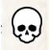
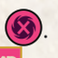
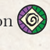
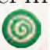
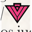

# Referencia de Iconos - Cthulhu: Dark Providence

Los iconos del reglamento no se reproducen de forma fiable en Markdown. Esta referencia usa códigos cortos para mantener las ayudas legibles y permitir sustitución por imágenes en el futuro.

| Icono | Codigo | Significado | Uso |
|---|---|---|---|
|  | `[INF]` | Influencia | Añadir cubos a cartas, Ciudades o Mitos. |
|  | `[RIQ]` | Riqueza | Adquirir nuevos cubos de Influencia: 2 riqueza = 1 cubo. |
|  | `[MOV]` | Viaje | Mover Agentes o Profundos por rutas. |
|  | `[POD]` | Poder | Igualar valores para asesinar o abrir/cerrar Portales. |
|  | `[ASE]` | Asesinar | Acción para eliminar Agentes rivales. |
|  | `[CER]` | Cerrar Portal | Acción asociada a Investigadores y Disidentes. |
|  | `[ABR]` | Abrir Portal | Acción asociada a Sectarios y Disidentes. |
|  | `[BLOQ]` | Bloqueo | Impide reclamar una carta o Ciudad. |
|  | `[COR]` | Prueba/Cordura | Icono de Prueba de Cordura en cartas. |
|  | `[LOC]` | Locura | Con la tercera ficha se revela Lealtad. |
|  | `[RIT+]` | Aumentar Ritual | Avanza el medidor de Ritual. |
|  | `[RIT-]` | Reducir Ritual | Retrocede el medidor de Ritual. |
|  | `[INV+]` | Aumentar Investigación | Avanza el medidor de Investigación. |
|  | `[INV-]` | Reducir Investigación | Retrocede el medidor de Investigación. |
|  | `[PV-GEN]` | PV genéricos | Puntuan para cualquier Lealtad. |
|  | `[PV-INV]` | PV de Investigador | Solo aplican a Investigadores, no a Disidentes. |
|  | `[PV-SEC]` | PV de Sectario | Solo aplican a Sectarios, no a Disidentes. |
|  | `[F-COR]` | Ficha de Cordura | Resultado de bolsa que no suma Locura. |
|  | `[F-LOC]` | Ficha de Locura | Resultado de bolsa que puede llevar a Locura. |
|  | `[M-INV]` | Marcador de Investigación | Marcador físico del medidor. |
|  | `[M-RIT]` | Marcador de Ritual | Marcador físico del medidor. |

## Reglas de Uso en Documentos

- Mantener el código corto junto al termino cuando sea relevante: `Poder [POD]`.
- No sustituir el nombre de la regla por el icono si puede crear ambiguedad.
- En ayudas de mesa, preferir texto claro antes que una cadena de iconos.
- Los PNG están en [img/icons](./img/icons/).
- Usar HTML en tablas si se necesita tamaño controlado: ``.
