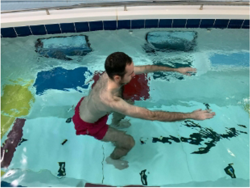
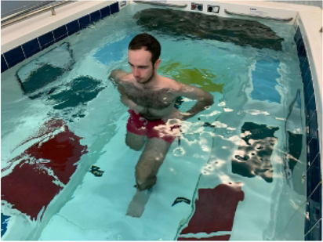
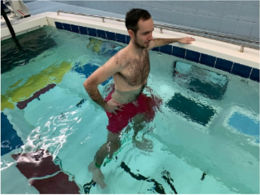
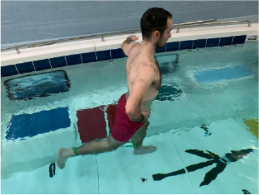
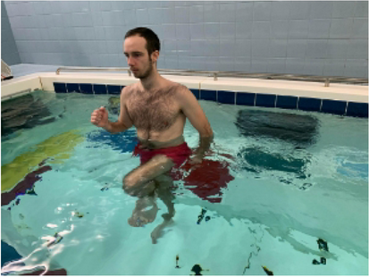
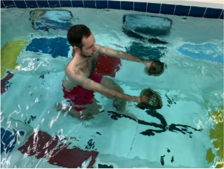
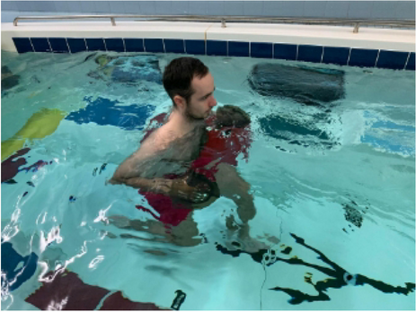
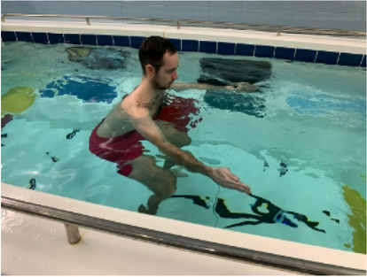
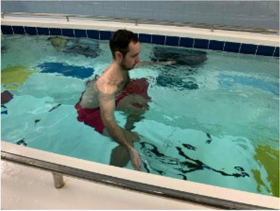

# Plan acuático adaptado: estabilización lumbar, abdomen y glúteos (30–45 min)

**Programa conservador de 12 semanas para poca masa o fuerza muscular, tres hernias lumbares y restricción expresa de no rotar el tronco**  
**Actualizado:** 4 de septiembre de 2026

> Este plan no diagnostica ni trata las hernias o una posible sarcopenia y no sustituye a un médico o fisioterapeuta que conozca la exploración neurológica, los niveles afectados y la respuesta individual a flexión y extensión. No debe iniciarse durante una crisis aguda ni sin confirmar que el ejercicio acuático está autorizado. Parte de que la persona puede entrar y salir de la piscina con seguridad y entrenará en una zona vigilada.

## Conclusión de la investigación

El ejercicio acuático bien dosificado puede mejorar la fuerza y la función. Un metaanálisis de 27 ensayos (1.006 participantes) encontró mejoras en fuerza de agarre y de rodilla, aunque muchos estudios tenían limitaciones metodológicas; la velocidad de movimiento y el uso de material parecían influir en el resultado ([Prado et al., 2022](https://pubmed.ncbi.nlm.nih.gov/27575248/)). Un metaanálisis más reciente de 13 ensayos en adultos mayores (531 participantes) estimó un efecto moderado sobre la fuerza y situó la franja más favorable en **2–3 sesiones semanales de 30–45 minutos**, con señal clara a partir de unas 12 semanas; sus autores advierten de heterogeneidad y posible sesgo de publicación, por lo que no debe interpretarse como una fórmula universal ([Wang et al., 2025](https://www.frontiersin.org/journals/public-health/articles/10.3389/fpubh.2025.1699018/full)).

La conclusión práctica es importante: **nadar suave suma actividad aeróbica, pero para ganar fuerza hay que vencer una resistencia progresiva**. Una revisión en personas con problemas musculoesqueléticos atribuyó parte de los resultados débiles a no aplicar bien los principios de resistencia ([Heywood et al., 2017](https://pubmed.ncbi.nlm.nih.gov/27666160/)). La guía ACSM de 2026 recomienda trabajar con esfuerzo alto —sin necesidad de llegar al fallo—, todos los grandes grupos musculares y al menos dos veces por semana ([ACSM, 2026](https://acsm.org/resistance-training-guidelines-update-2026/)); la [OMS](https://www.who.int/europe/news-room/fact-sheets/item/physical-activity) coincide en al menos dos días semanales de fortalecimiento.

La evidencia es más sólida para **fuerza, resistencia muscular, movilidad y función** que para un gran aumento de masa muscular. “Tonificar” no es una adaptación separada: en la práctica significa ganar o conservar músculo, mejorar su activación y, si procede, reducir grasa. Un metaanálisis de composición corporal encontró posibles mejoras de masa magra y músculo esquelético, sobre todo con más de 120 min/semana, pero con pocos estudios y sin convertir ese umbral en una garantía individual ([Su et al., 2023](https://pubmed.ncbi.nlm.nih.gov/37167802/)).

### Adaptación para las hernias lumbares

La guía clínica de la Academy of Orthopaedic Physical Therapy incluye ejercicio acuático, fortalecimiento y resistencia del tronco y activación específica de músculos profundos entre las opciones para dolor lumbar crónico; con dolor que baja por la pierna aconseja individualizar la activación y el control del movimiento ([George et al., 2021](https://pmc.ncbi.nlm.nih.gov/articles/PMC10508241/)). En un ensayo piloto de solo 31 personas con hernia discal lumbar, ocho semanas de estabilización —tres sesiones por semana— mejoraron dolor, discapacidad y resistencia estática del tronco tanto en agua como en tierra, sin diferencias entre ambos medios ([Bayraktar et al., 2016](https://pubmed.ncbi.nlm.nih.gov/26328542/)). Esto apoya entrenar la estabilidad, pero el estudio es pequeño y **no demuestra que una tabla genérica sea adecuada para cada hernia**.

Por ello, esta versión prioriza glúteo mayor y medio, abdomen profundo y resistencia isométrica del tronco con la columna en posición neutra. Se han eliminado giros, cortes diagonales, alcances cruzados, saltos y cambios bruscos de dirección. La prohibición de rotar responde a tu restricción concreta; no es una regla universal para todas las personas con hernia.

## Antes de empezar

- Si la pérdida muscular es involuntaria o rápida, hay caídas, dificultad creciente para levantarse de una silla, pérdida de peso, enfermedad reciente o fatiga anormal, conviene una valoración clínica. La sarcopenia no se diagnostica “a ojo”: el consenso europeo usa la fuerza baja como señal principal y confirma con cantidad/calidad muscular ([EWGSOP2](https://pmc.ncbi.nlm.nih.gov/articles/PMC6322506/)).
- Con tres hernias y una restricción de movimiento, pide al fisioterapeuta que confirme al menos: profundidad del agua, rango tolerado de cadera/rodilla, si puedes caminar hacia atrás y si existe alguna dirección lumbar que debas evitar además de la rotación.
- Pide autorización individual si existe enfermedad cardiovascular, pulmonar, renal o metabólica no estable, cirugía reciente, dolor agudo o indicación médica previa de limitar el ejercicio.
- Entrena en piscina vigilada y con otra persona. Si no sabes nadar, permanece donde hagas pie, junto a la pared; el [CDC](https://www.cdc.gov/drowning/prevention/index.html) recomienda el sistema de compañero y zonas con socorrista.
- No entrenes estando enfermo. Detente ante dolor/opresión torácica, mareo o desmayo, palpitaciones nuevas, falta de aire intensa o dolor articular/muscular fuerte. Una guía de hidroterapia del [NHS](https://www.worcsacute.nhs.uk/documents/documents/patient-information-leaflets-a-z/hydrotherapy-exercise-sheet-back-core//?layout=file) recoge las mismas señales de alarma.

**No hagas la sesión y solicita valoración urgente** si aparecen debilidad nueva o creciente en pierna/pie, pérdida de sensibilidad en glúteos, genitales o cara interna de los muslos, dificultad nueva para orinar/retener la orina, incontinencia intestinal o urinaria o pérdida nueva de función sexual. Son señales compatibles con compresión grave de los nervios de la cola de caballo ([North Bristol NHS Trust, 2024](https://www.nbt.nhs.uk/our-services/a-z-services/neurosurgery/neurosurgery-patient-information/same-day-emergency-clinic-sdec-cauda-equina-syndrome-sec)).

### Semáforo de síntomas durante y después

- **Verde:** esfuerzo muscular local, respiración controlada y síntomas iguales o mejores al terminar.
- **Amarillo:** aumenta el dolor lumbar sin extenderse; acorta el recorrido, baja la velocidad o pasa a marcha suave. Si no cede, termina la sesión.
- **Rojo:** el dolor se desplaza o baja más hacia glúteo/pierna, aparece hormigueo, adormecimiento, debilidad o cambia la marcha. Detén ese ejercicio y no lo reintentes hasta consultarlo.
- Si al día siguiente sigues claramente peor que antes de entrenar, reduce la siguiente sesión a la mitad o suspéndela y consulta. La progresión exige volver al nivel habitual entre sesiones.

## Material y escala de esfuerzo

**Material:** pared, cronómetro y una tabla. Desde la semana 5 se pueden añadir guantes acuáticos, churro o mancuernas de espuma en uno o dos ejercicios. Empieza sin palas rígidas de natación.

**Profundidad:** agua aproximadamente entre la cintura y la parte baja del pecho, donde se haga pie con estabilidad. Mantén la pared al alcance si hay poco equilibrio.

**Escala 0–10:**

| Sensación | RPE | Uso |
|---|---:|---|
| Muy fácil | 2–3 | Calentamiento, recuperación y vuelta a la calma |
| Moderado | 4–6 | Marcha acuática; aún se puede hablar |
| Difícil y controlado | 6–7 | Series de fuerza tras varias semanas sin reagudización; quedarían unos 5–10 s o 2–3 repeticiones con buena técnica |
| Máximo | 9–10 | No se utiliza en este plan |

La RPE de fuerza es **local**: valora cuánto trabajan los músculos, no solo cuánto jadeas. Nunca aguantes la respiración ni continúes hasta deformar el movimiento. No añadas cinturones lastrados ni palas rígidas y no busques fatigar directamente la zona lumbar.

## Calentamiento y vuelta a la calma

### Calentamiento fijo — 5 minutos

| Tiempo | Ejercicio |
|---:|---|
| 1 min | Marcha hacia delante, brazos relajados |
| 1 min | Marcha hacia atrás, pasos cortos, solo si está autorizada y no aumenta síntomas; si no, repite hacia delante |
| 1 min | Pasos laterales, 30 s por lado |
| 1 min | Abrir/cerrar ambos brazos de forma simétrica, pelvis y pecho mirando siempre al frente |
| 1 min | Marcha elevando poco las rodillas, abdomen suavemente firme |

### Vuelta a la calma — 5 minutos

| Tiempo | Ejercicio |
|---:|---|
| 3 min | Marcha muy suave, respiración normal |
| 2 min | Movilidad suave de tobillo, cadera y hombro; sin rotación lumbar ni llevar la espalda voluntariamente al final de flexión o extensión |

## Circuito A — glúteos y estabilidad central

Usa los seis ejercicios. Cada contracción isométrica dura solo 5–10 segundos y se repite respirando con normalidad.

| Código | Ejercicio | Zona principal | Clave técnica / versión fácil |
|---|---|---|---|
| A1 | Activación abdominal de pie | Transverso abdominal y estabilizadores lumbares | Costillas sobre pelvis; al soltar aire, tensa suavemente el abdomen como si fueras a recibir un empujón. Mantén 5 s sin meter barriga con fuerza ni mover la columna |
| A2 | Sentadilla corta + elevación de talones | Glúteo mayor, muslo y gemelo | Cadera atrás, rodillas hacia los dedos; baja solo hasta mantener columna neutra y talones apoyados. Sujétate a la pared |
| A3 | Abducción/aducción de cadera con apoyo | Glúteo medio | Pierna estirada va al lado y vuelve; pelvis nivelada y tronco inmóvil. Cambia de lado a mitad del intervalo |
| A4 | Extensión corta de cadera con apoyo | Glúteo mayor e isquios | Pierna atrás desde la cadera, sin inclinarte ni arquear la zona lumbar; recorrido pequeño |
| A5 | Marcha con abdomen firme | Abdomen, flexores de cadera y estabilidad | Eleva una rodilla poco, pausa y cambia; pelvis y hombros siempre al frente, sin balancearte |
| A6 | Plancha inclinada contra la pared | Abdomen y resistencia del tronco | Antebrazos en pared, da un paso corto atrás y forma una línea hombros–caderas–tobillos. Mantén 5–10 s respirando; más vertical es más fácil |

## Circuito B — cadena posterior y tronco sin giro

Todos los movimientos de brazos son bilaterales y simétricos. El pecho y la pelvis miran al frente durante todo el intervalo.

| Código | Ejercicio | Zona principal | Clave técnica / versión fácil |
|---|---|---|---|
| B1 | Zancada atrás corta con apoyo | Glúteo mayor, muslo y equilibrio | Paso corto y poca profundidad; baja en vertical con tronco neutro. Sustituye por A2 si provoca síntomas |
| B2 | Paso lateral + minisentadilla | Glúteo medio y muslo | Pasos cortos, pies paralelos y tronco al frente; no pivotes sobre el pie |
| B3 | Remo bilateral con palmas o tabla | Dorsal, espalda alta y estabilización del tronco | Brazos al frente, lleva ambos codos a las costillas sin inclinarte ni encoger hombros |
| B4 | Empuje bilateral de pecho | Pecho, tríceps y estabilización del tronco | Desde el pecho, empuja ambas manos o la tabla al frente; evita que la espalda se arquee |
| B5 | Abrir/cerrar brazos bajo el agua | Pecho, espalda y estabilización | Ambos brazos se mueven a la vez; codos blandos, manos sumergidas y tronco completamente quieto |
| B6 | Rodilla contra ambas manos, isométrico suave | Abdomen y estabilidad lumbopélvica | Eleva poco una rodilla y presiónala suavemente contra las dos manos durante 5 s; no acerques el pecho ni gires. Alterna lados |

La zona lumbar se trabaja aquí **resistiendo el movimiento**, no repitiendo flexiones, extensiones o giros. A1, A5, A6 y B3–B6 buscan que abdomen, multífidos y otros estabilizadores mantengan el tronco neutro mientras se mueven las extremidades. Al principio interesa más la resistencia y el control que sentir “quemazón” en la espalda.

## Guía visual de ejecución

Las fotografías siguientes son referencias de posición y recorrido, no una obligación de copiar la misma profundidad ni de usar el mismo material. Mantén el movimiento dentro de un rango cómodo, lento al aprender y sin dolor. En todos los ejercicios de pie, apoya toda la planta del pie, alarga el tronco y usa la pared si pierdes estabilidad.

### A2 — sentadilla y B1 — zancada

| Sentadilla | Zancada |
|---|---|
|  |  |
| **A2:** separa los pies aproximadamente al ancho de caderas, lleva la cadera atrás y flexiona solo hasta donde mantengas los talones apoyados, la espalda neutra y las rodillas alineadas con los pies. Al subir, añade la elevación de talones. | **B1:** da un paso corto hacia atrás y baja en vertical; mantén el pie delantero completamente apoyado. Empieza con poca profundidad y sujétate. Sustitúyela por A2 si aumenta síntomas. |

### A3/A4 — cadera y A5/B6 — control de rodilla

| Abducción de cadera | Extensión de cadera | Marcha: rodilla/talón |
|---|---|---|
|  |  |  |
| **A3:** desplaza una pierna hacia el lado sin inclinar el tronco ni girar la punta del pie hacia arriba. Vuelve controlando el agua. | **A4:** lleva la pierna atrás desde la cadera; contrae el glúteo y evita arquear la zona lumbar. El gesto puede ser pequeño. | **A5/B6:** eleva poco la rodilla con abdomen firme. En B6, usa las dos manos sobre el mismo muslo para que el tronco no tenga que resistir un giro. |

### B3/B4 — empuje de pecho y remo

| Posición extendida | Posición recogida |
|---|---|
|  |  |
| Mantén las manos o la tabla justo bajo la superficie, el pecho abierto y los hombros lejos de las orejas. Desde aquí empieza el **remo** hacia el cuerpo. | Lleva los codos hacia las costillas sin encoger los hombros. Desde aquí empieza el **empuje** al frente; extiende sin bloquear los codos. |

### B5 — abrir y cerrar brazos

| Brazos al frente | Apertura lateral |
|---|---|
|  |  |
| Junta las manos al frente con los codos ligeramente flexionados y las manos sumergidas. | Abre los brazos hasta un rango cómodo sin llevarlos por detrás del tronco; cambia la orientación de las palmas para resistir también al cerrar. |

**Procedencia de las imágenes:** fotografías de la tabla 1 de Rosenstein et al. (2023), reutilizadas sin modificación visual bajo [CC BY 4.0](https://creativecommons.org/licenses/by/4.0/). Consulta la [atribución detallada](imagenes/plan-natacion/ATRIBUCION.md). El protocolo original fue supervisado; estas fotografías no sustituyen una corrección técnica individual.

## Cuatro tablas de sesión, con tiempo exacto

Alterna circuito A y B entre sesiones. Cada “posición” del circuito dura 60 segundos e incluye trabajo y cambio de ejercicio.

### Sesión de 30 minutos — iniciación

| Bloque | Duración | Contenido |
|---|---:|---|
| Calentamiento | 5 min | Tabla fija de calentamiento |
| Fuerza | 12 min | A1–A6 o B1–B6, 2 vueltas. Cada minuto: 30 s trabajo + 30 s recuperación/cambio |
| Marcha acuática | 8 min | 8 × (40 s moderado + 20 s muy fácil), siempre de frente; cambia a pasos laterales sin pivotar si necesitas variedad |
| Vuelta a la calma | 5 min | Tabla fija |
| **Total** | **30 min** | |

### Sesión de 35 minutos — base

| Bloque | Duración | Contenido |
|---|---:|---|
| Calentamiento | 5 min | Tabla fija de calentamiento |
| Fuerza | 18 min | A1–A6 o B1–B6, 3 vueltas. Cada minuto: 40 s trabajo + 20 s cambio |
| Marcha acuática | 7 min | 7 × (40 s moderado + 20 s muy fácil), tronco al frente |
| Vuelta a la calma | 5 min | Tabla fija |
| **Total** | **35 min** | |

### Sesión de 40 minutos — fuerza + capacidad aeróbica

| Bloque | Duración | Contenido |
|---|---:|---|
| Calentamiento | 5 min | Tabla fija de calentamiento |
| Fuerza | 18 min | A1–A6 o B1–B6, 3 vueltas. Cada minuto: 40–45 s trabajo + 20–15 s cambio |
| Marcha acuática | 12 min | 12 × (40 s moderado + 20 s muy fácil), tronco al frente |
| Vuelta a la calma | 5 min | Tabla fija |
| **Total** | **40 min** | |

### Sesión de 45 minutos — cuerpo completo

| Bloque | Duración | Contenido |
|---|---:|---|
| Calentamiento | 5 min | Tabla fija de calentamiento |
| Fuerza | 24 min | A1–A6 o B1–B6, 4 vueltas. Cada minuto: 45 s trabajo + 15 s cambio |
| Marcha acuática | 11 min | 11 × (40 s moderado + 20 s muy fácil), tronco al frente |
| Vuelta a la calma | 5 min | Tabla fija |
| **Total** | **45 min** | |

**Opciones para el bloque de marcha:**

- Opción inicial: marcha hacia delante donde hagas pie, con pasos cortos y la pared al alcance.
- Para variar: pasos laterales sin cruzar los pies y sin pivotar; completa un intervalo hacia cada lado.
- Marcha hacia atrás solo si el fisioterapeuta la ha autorizado y no aumenta síntomas.
- El crol y la espalda implican rotación del tronco, y la braza puede exigir extensión lumbar. **No se incluyen** mientras esté vigente tu restricción; un fisioterapeuta podrá decidir si algún estilo y rango son adecuados.

## Progresión de 12 semanas

Deja unas 48 horas entre las sesiones de fuerza. Con tres sesiones, alterna **A–B–A** una semana y **B–A–B** la siguiente.

| Semanas | Frecuencia y duración | Trabajo/cambio | Esfuerzo de fuerza | Progresión permitida |
|---:|---|---|---:|---|
| 1–2 | 2 × 30 min | 30/30 s | RPE 3–4 | Sin material; aprender columna neutra, activación suave y respiración |
| 3–4 | 2 × 30–35 min | 30/30 o 40/20 s | RPE 4–5 | Añadir tiempo solo si los síntomas vuelven a su nivel habitual entre sesiones |
| 5–6 | 2 × 35–40 min; tercera de 30 min opcional | 40/20 s | RPE 5–6 | Algo más de velocidad o recorrido indoloro, no ambos |
| 7–8 | 2–3 × 40 min | 40/20 s | RPE 5–6 | Tabla solo en remo/empuje y si el tronco permanece inmóvil |
| 9–10 | 3 × 40–45 min | 40/20 o 45/15 s | RPE 6–7 | Cambiar una sola variable; no profundizar sentadilla o zancada por obligación |
| 11–12 | 3 × 45 min | 45/15 s | RPE 6–7 | Consolidar sin rotación, impacto ni esfuerzo máximo |

Si una fase deja fatiga que no se resuelve antes de la siguiente sesión, dolor articular o técnica claramente peor, repite la semana anterior o reduce una vuelta. La progresión no es obligatoria.

## Cómo crear sobrecarga en el agua

Cuando completes dos sesiones con buena técnica y RPE ≤6, cambia **solo una** opción:

1. Pasar de 30 a 40 s de trabajo manteniendo la respiración y la columna neutra.
2. Aumentar ligeramente la velocidad sin perder estabilidad.
3. Abrir más la mano o usar una tabla solo en movimientos bilaterales y simétricos.
4. Pasar de 40 a 45 s de trabajo.
5. Añadir la tercera sesión semanal, primero a intensidad fácil-moderada.

No aumentes deliberadamente el recorrido lumbar y no sumes a la vez velocidad, material y duración. En el agua, más rápido no siempre es mejor: la repetición cuenta solo si conserva postura, recorrido, respiración y síntomas estables.

## Seguimiento sencillo

Registra al inicio, semana 6 y semana 12:

| Indicador | Cómo medirlo | Qué buscar |
|---|---|---|
| Levantarse de una silla 30 s | Misma silla, brazos cruzados solo si es seguro | Más repeticiones con control, no una cifra diagnóstica |
| Tolerancia acuática | Número de intervalos completados en el bloque aeróbico | Igual trabajo con menor RPE o más distancia sin jadear |
| Calidad de fuerza | Ejercicios terminados dentro del RPE previsto (3–7 según la fase) | Mayor control o superficie con la misma postura y sin aumentar síntomas |
| Recuperación | Anotar dolor, cansancio y sueño al día siguiente | Sin empeoramiento acumulativo ni dolor articular persistente |
| Síntomas neurológicos | Anotar si dolor/hormigueo se extiende hacia glúteo o pierna | Nunca debe aparecer una distribución nueva o más distal |

No uses las agujetas como medida de éxito. Para valorar una posible sarcopenia, un profesional debe integrar fuerza, masa muscular y función.

## Nutrición y expectativas

El ejercicio necesita energía y proteína suficientes para construir tejido. En mayores de 65 años, la guía [ESPEN 2022](https://2022.espen.org/files/ESPEN-Guidelines/ESPEN_practical_guideline_Clinical_nutrition_and_hydration_in_geriatrics.pdf) propone al menos 1,0 g de proteína/kg/día y suele situar 1,0–1,2 g/kg/día en personas sanas, siempre individualizando por estado nutricional, enfermedad y tolerancia. Si existe enfermedad renal, pérdida de peso, poco apetito o una dieta restrictiva, la cantidad debe decidirse con médico o dietista; no se debe aumentar por cuenta propia.

## Calidad y límites de la evidencia

- **Confianza moderada:** el ejercicio acuático mejora fuerza y función frente a no entrenar.
- **Confianza baja y directa para hernia discal lumbar:** existe un ensayo piloto favorable de 31 participantes; no basta para validar esta combinación exacta ni para definir movimientos seguros en una persona concreta.
- **Confianza baja–moderada:** 30–45 min y 2–3 sesiones/semana parecen una dosis práctica, especialmente en adultos mayores, pero no son un “óptimo” seguro para todo el mundo.
- **Confianza menor:** el tamaño del aumento de masa muscular y el cambio estético. Los estudios mezclan modalidades, suelen ser pequeños y representan sobre todo a mujeres mayores.
- Las tablas anteriores son una síntesis prudente de principios de resistencia y ejercicios usados en ensayos; el conjunto exacto no ha sido probado como un protocolo clínico único.

### Fuentes principales

- Prado AKG et al. *Effects of Aquatic Exercise on Muscle Strength in Young and Elderly Adults: A Systematic Review and Meta-Analysis of Randomized Trials.* Journal of Strength and Conditioning Research, 2022. [PubMed](https://pubmed.ncbi.nlm.nih.gov/27575248/).
- Wang Y et al. *Optimal dose of aquatic exercise for improving muscle strength in older adults: a Bayesian model-based meta-analysis.* Frontiers in Public Health, 11 diciembre 2025. [Texto completo](https://www.frontiersin.org/journals/public-health/articles/10.3389/fpubh.2025.1699018/full).
- Gao Y et al. *Effects of aquatic exercise on improving body composition and muscle strength in the older adults.* Frontiers in Public Health, febrero 2026; corrección publicada en marzo de 2026. [PubMed](https://pubmed.ncbi.nlm.nih.gov/41743679/).
- Currier BS et al. *Resistance Training Prescription for Muscle Function, Hypertrophy, and Physical Performance in Healthy Adults: An Overview of Reviews.* ACSM/Medicine & Science in Sports & Exercise, 2026. [Resumen oficial de ACSM](https://acsm.org/resistance-training-guidelines-update-2026/) y [PubMed](https://pubmed.ncbi.nlm.nih.gov/41843416/).
- Heywood S et al. *Effectiveness of Aquatic Exercise in Improving Lower Limb Strength in Musculoskeletal Conditions.* Archives of Physical Medicine and Rehabilitation, 2017. [PubMed](https://pubmed.ncbi.nlm.nih.gov/27666160/).
- Su Y et al. *The effects of water-based exercise on body composition: A systematic review and meta-analysis.* Complementary Therapies in Clinical Practice, 2023. [PubMed](https://pubmed.ncbi.nlm.nih.gov/37167802/).
- Rosenstein B et al. *Effect of aquatic exercise versus standard care on paraspinal and gluteal muscles morphology in individuals with chronic low back pain: a randomized controlled trial protocol.* BMC Musculoskeletal Disorders, 2023. [Artículo y tabla ilustrada](https://link.springer.com/article/10.1186/s12891-023-07034-0). Licencia [CC BY 4.0](https://creativecommons.org/licenses/by/4.0/).
- George SZ et al. *Interventions for the Management of Acute and Chronic Low Back Pain: Revision 2021.* Journal of Orthopaedic & Sports Physical Therapy, 2021. [Texto completo](https://pmc.ncbi.nlm.nih.gov/articles/PMC10508241/).
- Bayraktar D et al. *A comparison of water-based and land-based core stability exercises in patients with lumbar disc herniation: a pilot study.* Disability and Rehabilitation, 2016. [PubMed](https://pubmed.ncbi.nlm.nih.gov/26328542/).
- National Institute for Health and Care Excellence. *Low back pain and sciatica in over 16s: assessment and management (NG59).* [Recomendaciones](https://www.nice.org.uk/guidance/NG59/chapter/recommendations).
- North Bristol NHS Trust. *Cauda Equina Syndrome.* Información para pacientes, 2024. [Señales de alarma](https://www.nbt.nhs.uk/our-services/a-z-services/neurosurgery/neurosurgery-patient-information/same-day-emergency-clinic-sdec-cauda-equina-syndrome-sec).
- World Health Organization Europe. *Physical activity.* [Recomendaciones oficiales](https://www.who.int/europe/news-room/fact-sheets/item/physical-activity).
- Cruz-Jentoft AJ et al. *Sarcopenia: revised European consensus on definition and diagnosis (EWGSOP2).* Age and Ageing, 2019. [Texto completo](https://pmc.ncbi.nlm.nih.gov/articles/PMC6322506/).
